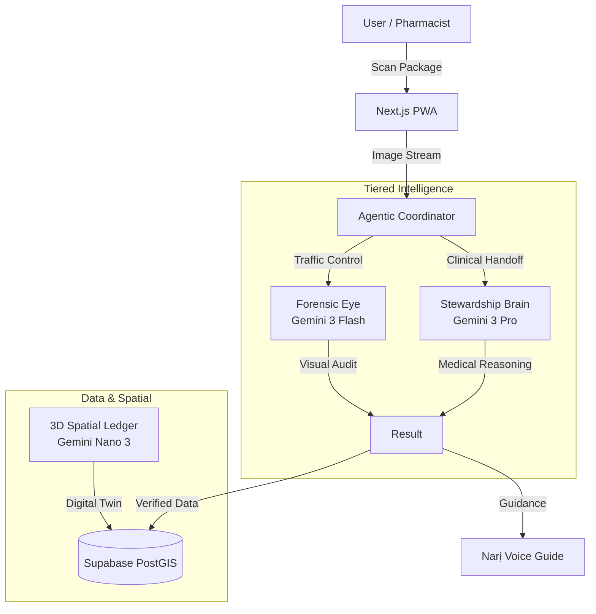

# Ndunari: The Life-Saving Agentic Health Shield


**A Decentralized Pharmaceutical Surveillance Network Powered by Gemini 3.**

In Igbo, the name is a compound of two powerful concepts:

Ndụ: This means "Life". It is a fundamental root in Igbo philosophy, representing existence, vitality, and well-being.

Nari: This is often associated with the number "Hundred" (Nnarị) or "Exceeding".

When combined into Ndunari, the name translates to "Life in Abundance" or "Life that Exceeds" (a hundredfold).

---

## 🚨 The Life-or-Death Problem

In Nigeria, the pharmaceutical supply chain is a matter of life and death.

*   **331,500 annual deaths** are attributed to falsified medications and Antimicrobial Resistance (AMR).
*   **64,500 deaths** are directly caused by bacteria that no longer respond to treatment.
*   **70% of Staphylococcus aureus** infections in Nigeria are now resistant to first-line antibiotics like amoxicillin.
*   **Counterfeit Proliferation**: Without a public API for verification, millions of citizens unknowingly purchase substandard drugs that lead to treatment failure and death.

]
*The silent epidemic: AMR and fake drugs claim thousands of lives annually.*


---

## 🧠 Frontier AI Solution: Tiered Agent Architecture

Ndunari is a **Forensic Lab in a Pocket**. We utilize a sophisticated, multi-agent architecture to deliver institutional-grade verification to 140 million Nigerians.

### 1. The Forensic Eye (Gemini 3 Flash)
*   **Role**: High-Speed Visual Forensics.
*   **Mechanism**: Uses high-resolution vision to scan drug packaging in real-time. It detects microscopic printing errors, validates NAFDAC number syntax, and identifies structural inconsistencies that the human eye misses.
*   **Cost**: Low-latency, low-cost inference for mass adoption.

### 2. The Stewardship Brain (Gemini 3 Pro)
*   **Role**: Clinical Reasoning & "High Thinking".
*   **Mechanism**: When a "Reserve" or "Watch" group antibiotic is detected, the **Agentic Coordinator** hands off the session to Gemini 3 Pro.
*   **Lock**: This model is strictly locked to **Temperature 1.0** to enable rigorous medical reasoning, justifying the prescription against WHO AWaRe categories and NCDC guidelines.

---

## 🧊 The 3D Spatial Ledger (Gemini Nano 3) - Coming Feature

Ndunari is getting a breakthrough in pharmaceutical tracking: **On-Device 3D Reconstruction**.

Most verification systems rely on 2D barcodes which are easily xeroxed by counterfeiters. Ndunari uses **Gemini Nano 3** to construct a **3D Digital Twin** of the physical drug package.

*   **Spatial Verification**: By analyzing the package from multiple angles, we create a spatial fingerprint that cannot be replicated by 2D printing.
*   **NAFDAC Tracking**: These 3D artifacts are stored in a secure ledger, allowing regulators to virtually inspect the inventory of any pharmacy in Nigeria from a central dashboard.


---

## ⚡ Technical Excellence 

Ndunari has been engineered for reliability in a high-stakes clinical environment.

*   **Agentic Coordinator Logic**: The central brain intelligently manages handoffs between the *Forensic Eye* (Vision) and *Stewardship Brain* (Reasoning), ensuring the right model is used for the right task.
*   **Thought Signature Protocol**: To prevent "hallucinations" or malformed JSON that leads to 400 errors, I implemented a strict Thought Signature protocol. Every agent response includes a verifiable reasoning trace before the final output.
    ```typescript
    // Real-world example of an Agent's Thought Signature
    interface AgentResponse {
      status: 'success' | 'escalated';
      thoughtSignature: {
        id: "sig_8f7a9d2",
        timestamp: "2026-01-23T14:00:00Z",
        reasoning_trace: "Analyzed holographic overlay. Optical variable ink shift absent. High probability of counterfeit."
      };
      data: { ... }
    }
    ```
*   **High-Resolution Vision Pipeline**: Ndunari bypasses standard image compression to feed raw, high-fidelity visual data to Gemini, enabling the detection of micro-text and hologram flaws.
*   **PWA-Native**: Built as a Progressive Web App, Ndunari offers **zero-friction access**. It requires no app store download, works offline, and is accessible on low-end devices typical in rural Nigeria.

---

## 🌍 Social Impact 

**Democratizing Health Security.**

*   **92% Cost Savings**: By using its Tiered Architecture (Flash for the masses, Pro for exceptions), Ndunari reduces the cost of verification by 92%, making this life-saving technology deployable to 140 million people for free.
*   **Narị Multilingual Counselor**: Access shouldn't be limited by language. Ndunari speaks **5 Nigerian languages** (English, Pidgin, Yoruba, Hausa, Igbo) fluently, breaking down barriers to care.


```

---

## 🎯 How the Sentinel Works: A Complete Scenario

The **Ndunari Sentinel** is your autonomous health guardian. It combines three data sources to protect you:

### Data Sources
1. **Your Personal Scan History** - Every drug you've scanned
2. **Global Surveillance Intelligence** - Aggregated threats from the entire Ndunari network
3. **Medication Adherence Behavior** - Your active medication courses and completion rates

### Real-World Example Scenario

**Day 1 (Monday):**
- You scan a suspicious "Amoxicillin" package at a pharmacy
- The **Forensic Eye** detects subtle printing errors in the NAFDAC logo
- VERDICT: "Suspected Counterfeit"
- Your scan is logged and anonymized geolocation data is recorded (e.g., "Lagos, Nigeria")

**Day 1 (Evening):**
- You navigate to the **Home Page**
- The Sentinel automatically analyzes your scans + global data
- **DIRECTIVE ISSUED**: 
  ```
  TYPE: IMMEDIATE_WARNING
  PRIORITY: Critical
  SOURCE: PERSONAL
  RATIONALE: "You scanned a suspected counterfeit Amoxicillin. Fake antibiotics can cause treatment failure and death."
  ACTION: "Return the purchase immediately. Buy only from NAFDAC-verified pharmacies."
  ```

**Day 3 (Wednesday):**
- You purchase genuine Amoxicillin from a verified pharmacy and start a 10-day course
- You log this in the **/drugs** Medication Tab
- The system sets up a dosing schedule (3x daily, 8-hour intervals)

**Day 5 (Friday):**
- You feel better and decide to stop taking the antibiotic (only 4/10 days complete)
- You try to delete the course from the **Medications Tab**
- **AMR GUARDIAN INTERCEPT TRIGGERED**:
  ```
  GUARDIAN WARNING: "Stopping Amoxicillin at 40% creates resistant bacteria."
  SCIENTIFIC RATIONALE: "Incomplete antibiotic courses allow surviving bacteria to mutate. This is the #1 cause of Superbugs."
  CHOICES:
  - "I Will Finish The Course" (Recommended)
  - "I understand the risk, stop anyway"
  ```

**Day 6 (Saturday):**
- You ignore your dose reminder and are now 50 hours late
- You open the **Home Page**
- The Sentinel analyzes your behavior + detects the overdue dose
- **NEW DIRECTIVE ISSUED**:
  ```
  TYPE:STEWARDSHIP_ACTION
  PRIORITY: High
  SOURCE: PERSONAL
  RATIONALE: "You are 50 hours overdue on your Amoxicillin dose. Therapeutic levels have dropped, risking treatment failure."
  ACTION: "Take your dose immediately and resume the schedule. If you feel well, still finish the full course."
  ```

**Day 7 (Sunday):**
- Meanwhile, 50 other Ndunari users in Lagos scanned fake "Artemether" (Antimalarial)
- This creates a regional cluster
- You open the Home Page again
- **GLOBAL INTELLIGENCE DIRECTIVE**:
  ```
  TYPE: REGIONAL_ALERT
  PRIORITY: Medium
  SOURCE: GLOBAL
  RATIONALE: "Global intelligence detects a 60% surge in fake Antimalarials in your region (Lagos)."
  ACTION: "Avoid purchasing Antimalarials from street vendors. Cross-reference all purchases with the Ndunari network."
  ```

### Key Insight
The Sentinel doesn't just react to YOUR scans. It:
1. **Prevents you** from making dangerous purchases (Personal Directives)
2. **Warns you preemptively** about regional threats before you encounter them (Global Directives)
3. **Monitors your medication behavior** to prevent AMR spread (Adherence Directives)

This is **Collective Intelligence for Public Health**.

---

## 🏗️ Architecture



---

## 🚀 How to Run (Quick Start)

You can run the full PWA locally in 3 steps:

1.  **Install Dependencies**:
    ```bash
    npm install
    ```

2.  **Set Environment Variables**:
    Create a `.env.local` file with your Gemini and Supabase keys:
    ```bash
    NEXT_PUBLIC_GEMINI_API_KEY=...
    NEXT_PUBLIC_SUPABASE_URL=...
    NEXT_PUBLIC_SUPABASE_ANON_KEY=...
    ```

3.  **Run Development Server**:
    ```bash
    npm run dev
    ```
    Open [http://localhost:3000](http://localhost:3000) to view the application.

---

## 🛡️ License
MIT License. Open Science for Global Health.
